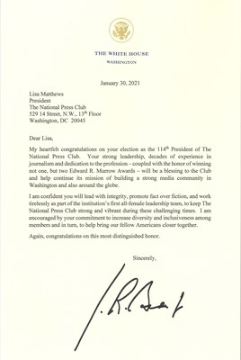

# 📄 Legal Document Digitization System

<a href="https://universe.roboflow.com/major-a0zsb/documents-dataset-yygxz">
    </img>
</a>


A Document digitization system designed specifically for the legal sector, capable of converting scanned legal documents into searchable, structured digital formats using computer vision, Optical Character Recognition and error correction techniques.


You can try it out [here.](https://legal-document-digitization.streamlit.app/#legal-document-digitizer)
## 🎯 Project Overview

This system automates the digitization of legal documents through a sophisticated pipeline that includes document preprocessing, text region detection, OCR, domain-specific error correction, and named entity recognition. The processed data is stored in a structured database, making it easily accessible and searchable.


## 🖼️ Input and Result Examples

Here are some examples of the system's input and output:

<table>
  <tr>
    <th>Input</th>
    <th>Result</th>
  </tr>
  <tr>
    <td></td>
    <td></td>
  </tr>
</table>

## 💻 User Interface Screenshots

Here are some screenshots of the user interface:

<p align="center">
  
</p>

<p align="center">
  
</p>

### Key Features

- **Intelligent Document Preprocessing**
  - Automatic deskewing and rotation correction
  - Advanced binarization for enhanced text clarity
  - Optimized image enhancement for better OCR results

- **Custom YOLOv8-based Text Region Detection**
  - Trained on legal documents for specific layout understanding
  - Detection of four key elements:
    - Text blocks
    - Tables
    - Stamps
    - Signatures

- **Advanced OCR Pipeline**
  - Region-specific text extraction using YOLO detections.
  - Error correction using Mixtral-7b.

## 🧠 LLM Integration

This system leverages the Mixtral-8x7b-32768 LLM for further analysis on the extracted text.
The LLM processes OCR-extracted text via Groq cloud's API. The LLM is given a prompt template to follow, to give these:

* **NER:** Extract and classify entities (person, organization, date, location)
* **Summarization:** Generates concise document summary.
* **Error Correction:** Analyze and correct rudimentary OCR errors using contextual understanding.
* **Structured Output:** Provides output of the entities and the document summary in JSON format.

## 🚀 Getting Started

### Prerequisites

To run this project, you need the following dependencies:

```bash
# Core Requirements
- Python 3.x
- PyTorch
- YOLOv8
- OpenCV
- PyTesseract
- Streamlit
```

### Installation

1. Clone the repository:
   ```bash
   git clone https://github.com/PhoenixAlpha23/Legal-Document-Digitization.git
   cd Legal-Document-Digitization
   ```

2. Install the required dependencies:
   ```bash
   pip install -r requirements.txt
   ```
---
## 🛠️ Technical Architecture

The system follows a modular pipeline architecture:

1.  **Document Input**: Accepts scanned legal documents in various formats (PDF, JPG, JPEG).
2.  **Preprocessing Module**:
    * Image enhancement
    * Deskewing and rotation correction
    * Binarization for improved Text visibility and accuracy on OCR.
3.  **Text Region Detection**:
    * Custom YOLOv8s model trained on legal documents
    * Region classification and localization (text, tables, stamps, signatures)
4.  **OCR Processing**:
    * Region-wise text extraction on table and text region.
    
5.  **LLM Error correction:**
    * Mixtral-8x7b-32768 LLM used for:
        * Named Entity Recognition (NER)
        * Document Summarization
        * OCR Error Correction
6. **Output:**
    * Structured data output (JSON) containing extracted entities and summary.

Here’s the updated performance metrics section with the new data you provided, formatted consistently with the README:

---

## 📊 Performance Metrics

### Current YOLOv8 Model Performance

| Class      | Precision (P) | Recall (R) | mAP50  | mAP50-95 |
|------------|---------------|------------|--------|----------|
| **All**    | 0.641         | 0.503      | 0.481  | 0.324    |
| Signature  | 0.429         | 0.370      | 0.305  | 0.171    |
| Stamp      | 0.898         | 0.594      | 0.718  | 0.598    |
| Table      | 0.762         | 0.529      | 0.528  | 0.359    |
| Text       | 0.476         | 0.519      | 0.372  | 0.169    |

### Training Details
- **Epochs**: 255
- **Training Time**: 1.452 hours
- **Model Size**: 22.5MB (optimizer stripped)
- **Hardware**: Tesla T4 GPU (15GB VRAM)
- **Framework**: Ultralytics YOLOv8, Python 3.10.12, PyTorch 2.5.1+cu121
- **Speed**:
  - Preprocess: 0.2ms per image
  - Inference: 5.2ms per image
  - Postprocess: 0.8ms per image

---
## 🚀 Future Enhancements

* **Fine-tuning ByT5 for Enhanced Legal Text Processing:**
    * We are planning to fine-tune a ByT5 (Byte-to-Byte Transformer) model on the IL-TUR multilingual legal annotated dataset.
    * The IL-TUR dataset is a valuable resource specifically curated for Indian legal documents, providing a diverse collection of annotated legal texts across multiple indian languages.
    * ByT5 is an ideal choice for this task due to its:
        * **Byte-level processing:** This allows it to handle variations in spelling and complex legal terminology effectively, which is particularly crucial in multilingual legal documents.
        * **Strong performance in sequence-to-sequence tasks:** ByT5 excels at tasks like error correction and NER, where it needs to understand the context of the input text and generate accurate output.
    * Fine-tuning ByT5 on the IL-TUR dataset will enable:
        * **Fine-grained error correction:** The model will learn the specific nuances of legal language and common OCR errors in the Indian legal context.
        * **Improved contextual understanding:** ByT5 will gain a deeper understanding of the relationships between words and phrases in legal documents, leading to more accurate analysis.
        * **More specific NER:** The model will learn to identify and classify legal entities with greater precision, leveraging the rich annotations in the IL-TUR dataset.

---

## 📝 License

This project is licensed under the **Apache 2.0 License**. See the [LICENSE](https://github.com/ummessh/Legal-Document-Digitization/blob/main/LICENSE) file for details.

---

## 🙏 Acknowledgments

- **Roboflow** for dataset annotation tools.
- **Groq Cloud** for utilising Mixtral-8x7b-32768 via Groq API.
- **Ultralytics**,**PyTesseract** and **Streamlit Cloud** communities for their excellent tools and documentation.

